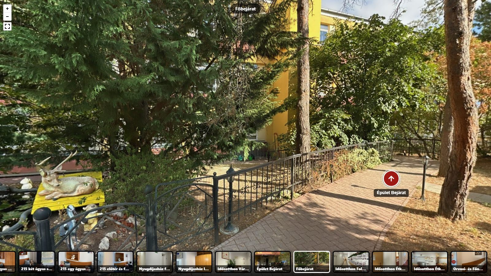

# StaticTour

**The stupid-simple 360° virtual tour builder for web developers. One HTML file. Static output. Your server. No subscription.**

Open `editor.html`, drop in panoramas, click doors, download a folder, upload it to the client's host, send the invoice. No Docker, no desktop app, no account, no cloud.

[](https://www.tamaszotthon.hu/virtualis-seta)

**[▶ Live demo](https://www.tamaszotthon.hu/virtualis-seta)** – a real nursing home in Hungary, 17 rooms, built with this editor and served as plain static files from a cheap shared host. &nbsp;·&nbsp; **[🧭 Open the editor](https://davidmajzik.github.io/statictour/editor.html)** – runs entirely in your browser, nothing is uploaded.

---

## Why this exists

There is no shortage of 360° tour tools. Most are hosted subscriptions: Kuula ($20–48/mo), Matterport ($10–69/mo plus ~$20/mo per hosted space), Theasys ($20/mo). A couple will sell you a self-hosted export for a one-time $10 (Lapentor, Theasys). And there are open-source editors that export static sites – PanoPath (Docker + Marzipano), LibreTours 360 (self-hosted web app), panoradesk-360 (Electron) – which are good, and further along on features like floor plans and branding presets.

StaticTour's bet is narrower. A web developer who gets asked for "a virtual tour" once a year doesn't want to run a Docker container, install a desktop app, or open a SaaS account for a $200 line item. They want to open a file, click, get a folder, and move on.

| | Hosted SaaS (Kuula, Matterport…) | Self-hosted OSS (PanoPath, LibreTours…) | StaticTour |
|---|---|---|---|
| Install | None | Docker / server / Electron | **None – one HTML file** |
| Account | Required | No | **No** |
| Monthly fee | $10–70 | $0 | **$0** |
| Where the tour lives | Their cloud | Your server | **Your server** |
| Your photos leave your machine | Yes | No | **No** |
| Floor plans, branding presets | Some | Yes | Not yet |
| Lines of code to read before trusting it | n/a | thousands | **~600** |

It was built for a nursing home that didn't want a subscription, by a developer who didn't want to set up infrastructure for a one-off job.

## How it works

1. **Drop in your 360° panoramas** – equirectangular JPG/PNG (2:1 aspect ratio, straight from a Ricoh Theta, Insta360, GoPro Max or any 360° camera app). Images are resized to 6144 px and re-encoded in the browser; nothing leaves your machine.
2. **Place arrows** – click on a door, pick which room it leads to. Set the entry view for each room. Built-in checks warn you about unreachable rooms.
3. **Download `tour.zip`** – unzip it, upload the `tour/` folder to your web server (FTP, cPanel, Netlify drop, GitHub Pages, S3, whatever). Open `/tour/`. That's the tour.

The ZIP is self-contained: `index.html` (viewer), `pannellum.js` + `pannellum.css` (vendored, no CDN at runtime), `tour.json` (the data – re-open it in the editor to keep editing), `images/` (panoramas + thumbnails).

## Features

- **Zero backend** – editor and viewer are plain HTML + vanilla JS. No build step for users, no npm, no framework.
- **Self-hosted output** – the exported tour has no external requests at all. Works offline, works on an intranet, works from a USB stick.
- **Mobile-first viewer** – touch to look around, gyroscope support, thumbnail strip, full-screen, pinch zoom.
- **Keyboard accessible** – arrow keys to pan, thumbnails are real `<button>`s with labels.
- **Embed-ready** – the editor hands you a responsive `<iframe>` snippet after export. When embedded, the viewer shows an "open full screen" link.
- **Round-trip editing** – re-open any exported `tour.zip` in the editor, add rooms, move arrows, export again. Cache-busting version stamp on every export so visitors never see stale images.
- **Sanity checks** – warns about rooms with no arrows and rooms you can't reach from the start room.
- **One file** – the whole editor is a single 40 KB `editor.html`. Fork it, rebrand it, ship it to your client.

## Quick start

**Just use it:** open **[the hosted editor](https://davidmajzik.github.io/statictour/editor.html)**. It's the same file as in this repo, served from GitHub Pages.

**Run it locally:**

```bash
git clone https://github.com/DavidMajzik/statictour.git
cd statictour
node build.js        # inlines src/viewer-template.html into editor.html
# then open editor.html in a browser – that's it
```

The editor needs an internet connection only to load Pannellum and JSZip from a CDN (and to vendor Pannellum into your ZIP on export). Your images never go anywhere.

**Repo layout:**

| Path | What |
|---|---|
| `editor.html` | The built, self-contained editor (generated – don't edit by hand) |
| `src/editor.src.html` | Editor source |
| `src/viewer-template.html` | The viewer that ends up as `index.html` inside every exported tour |
| `build.js` | 12-line build script: merges the template into the editor |
| `index.html` | Landing page (GitHub Pages) |
| `docs/` | Screenshots |

## Pricing

**This repo is free, complete, and MIT-licensed. Use it for clients, fork it, rebrand it, sell tours made with it. Nothing here is crippled.**

If enough people want it, there will be a paid tier for developers who build tours regularly. It would be **one-time, per tour, roughly €5–10** – the range Lapentor and Theasys already charge for a self-hosted export – and **never a subscription**. What it would add on top of this editor (none of which exists yet):

- cloud project save (no more "where did I put that ZIP")
- white-label / branding presets and your own logo in the viewer
- floor plan overlay with "you are here"
- tiled multi-resolution output for 16K+ panoramas
- agency templates and a shareable client preview link

The free editor keeps everything it has today.

**[→ Join the waitlist](https://tally.so/r/PLACEHOLDER)** – one question: would you use this for a client project? I'll build the paid tier if the answer is yes often enough, and leave the repo alone if it isn't.

## Tech stack

- [Pannellum](https://pannellum.org/) 2.5.6 – the WebGL panorama viewer (MIT)
- [JSZip](https://stuk.github.io/jszip/) 3.10 – ZIP creation in the browser (MIT)
- Canvas API for client-side resizing / thumbnail crops
- Vanilla JS, no framework, no bundler. `build.js` is the only Node usage and it's 12 lines.

## Roadmap

Depends entirely on whether anyone besides me wants this. Candidates, in rough order:

- [ ] Info hotspots (text / image popups on a panorama)
- [ ] Floor plan overlay with "you are here"
- [ ] Custom accent colour + logo in the export
- [ ] Paid tier: cloud save, white-label, floor plans (see Pricing)
- [ ] WordPress plugin

Open an issue if you need one of these – or something else.

## Contributing

PRs welcome. Keep it dependency-free and keep `editor.html` a single file. Run `node build.js` after editing anything in `src/`.

## Alternatives

Be honest with yourself about which one you need:

- **[PanoPath](https://github.com/illerin/PanoPath)** – Docker, Marzipano-based, floor plans, branding, style presets, ZIP export. More features; needs a server to run the editor.
- **[LibreTours 360](https://github.com/wishmerhill/libretours-360)** – self-hosted web editor + viewer.
- **[panoradesk-360](https://github.com/hamzah1985/panoradesk-360)** – Electron desktop editor, Photo Sphere Viewer, MIT, offline exports.
- **[Lapentor](https://lapentor.com/)** / **[Theasys](https://www.theasys.io/)** – hosted editors that sell a one-time $10 self-hosted export.
- **[Pannellum](https://pannellum.org/) by hand** – if you're fine writing the scene JSON yourself, you don't need any of the above.

StaticTour is the one you pick when "open a file" is the whole requirement.

## Credits

- [Matthew Petroff](https://mpetroff.net/) for Pannellum
- [Stuart Knightley](https://github.com/Stuk) for JSZip
- [TÁMASZ Idősek Otthona](https://www.tamaszotthon.hu) for being the first real-world tour

## License

[MIT](LICENSE) © 2026 Dávid Majzik
